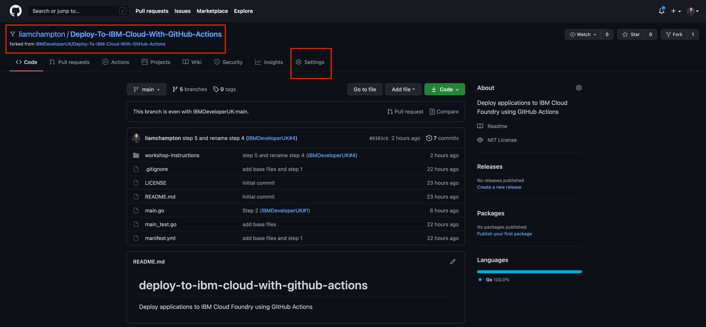
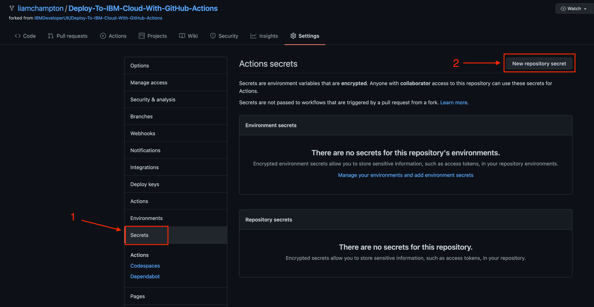
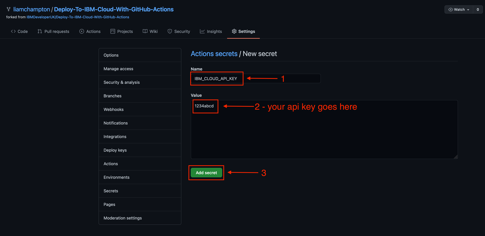
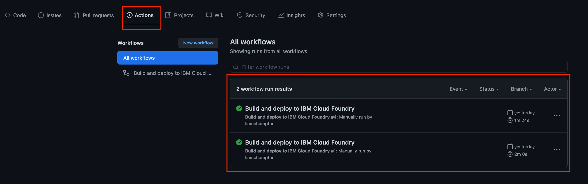

# Step 5 - Automate the deployment

Head over to **your forked** repository in GitHub and click on the `Settings` tab



Scroll down to, and click on `Secrets`



Click on `New repository secret`

Fill out the details as follows

Name: `IBM_CLOUD_API_KEY`

Value: Your IBM Cloud API key you created in Step 2

Click `Add secret` to save this to your repository



Head back to your project in your code editor.

In the root of the project create a folder called `.github`

Inside the new `.github` folder, create a new folder called `workflows`

You should now have a directory that looks like `.github/workflows`

Inside the folder `/workflows`, create a new file called `main-cf-push.yml`

This file will contain the GitHub Actions workflow configuration.

Copy the code below into the new file

**Ensure you change your Cloud ORG in the environment variables. This can be found by running the command `ibmcloud account orgs` (use the Name)**

```yaml
name: Build and deploy to IBM Cloud Foundry

on:
  push:
    branches:
    - main

# Environment variables available to all jobs and steps in this workflow
env:
  IBM_CLOUD_REGION: eu-gb
  IBM_CLOUD_GROUP: Default
  IBM_CLOUD_SPACE: dev
  IBM_CLOUD_ORG: <your-cloud-org>
  MANIFEST_NAME: manifest.yml
  IBM_CLOUD_API: ${{secrets.IBM_CLOUD_API_KEY}}

defaults:
  run:
    working-directory: ./

jobs:
  build:
    runs-on: ubuntu-latest

    steps:

    # Use Go version 1.16.0
      - uses: actions/checkout@v2
      - name: Setup Go
        uses: actions/setup-go@v2
        with:
          go-version: '1.16.0'

    # Install dependencies
      - name: Install dependencies
        run: |
          go version
          go get -u golang.org/x/lint/golint
          echo install other deps in this section

    # Add go build commands if you wish you create binary artifacts
      - name: Build application
        run: |
          echo build application binary in this section

    # Run vet & lint against the code
      - name: Run go vet and lint
        run: |
          go vet .
          golint .
      
    # Run the test we created for the application
      - name: Run testing
        run: |
          go test -v

  deploy:
    runs-on: ubuntu-latest

    steps:

    # Install IBM CLI into the image
      - uses: actions/checkout@v2
      - name: Install IBM CLI
        run: |
          curl -fsSL https://clis.cloud.ibm.com/install/linux | sh
          ibmcloud --version
          ibmcloud config --check-version=false
        shell: bash
    
    # Install the Cloud Foundry plugin
      - name: Install CF plugin
        run: ibmcloud cf install -f
        shell: bash

    # Login to IBM Cloud
      - name: Login to IBM Cloud
        run: |
          ibmcloud login --apikey "$IBM_CLOUD_API" -r "$IBM_CLOUD_REGION" -g "$IBM_CLOUD_GROUP"
        shell: bash

    # Target Cloud Foundry
      - name: Target CF
        run: ibmcloud target --cf-api https://api.$IBM_CLOUD_REGION.cf.cloud.ibm.com -r $IBM_CLOUD_REGION -o $IBM_CLOUD_ORG -s $IBM_CLOUD_SPACE
        shell: bash
    
    # Deploy the application
      - name: Deploy manifest file
        run: ibmcloud cf push -f ./$MANIFEST_NAME
        shell: bash
```

Save your project and commit this into GitHub.

Head back over to your GitHub repository and select the tab `Actions`



From here you can see the workflows that have run.

Let's make a change to the application output. Instead of the output being "This is a test for GitHub Actions", have it output "This is *your-name*'s GitHub Actions demo".

Update the test code and then commit it into GitHub.

Wait for the workflow to finish and then check your application using the route you specified in your `manifest.yml`. You will see your updated change!

:tada: Congratulations, you have completed this workshop! You now have the skills needed to deploy your applications into IBM Cloud Foundry using a GitHub Action workflow! :tada: